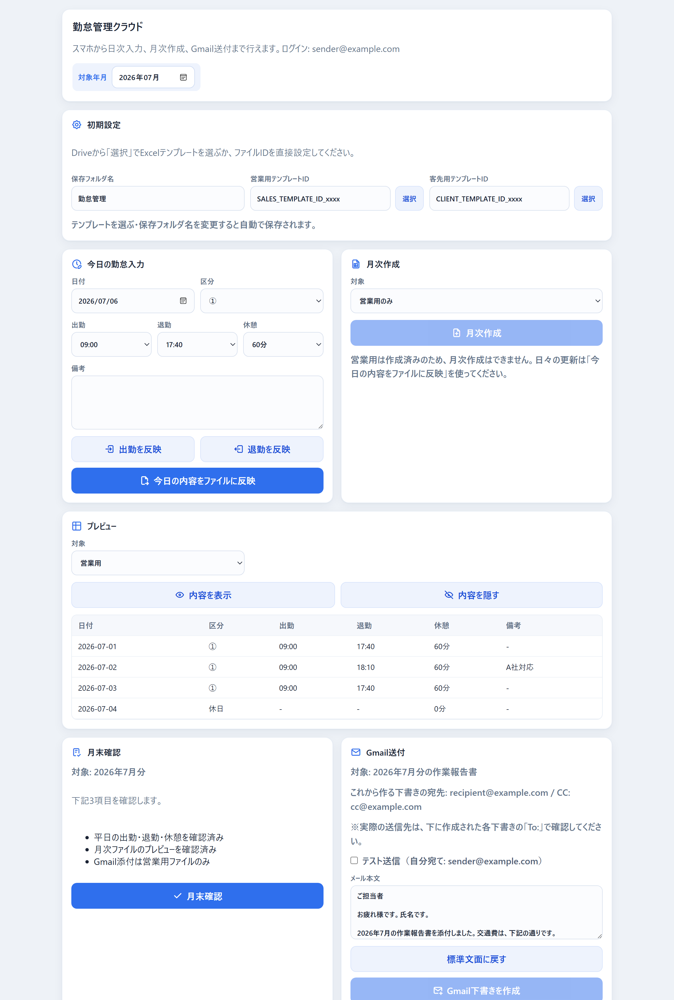
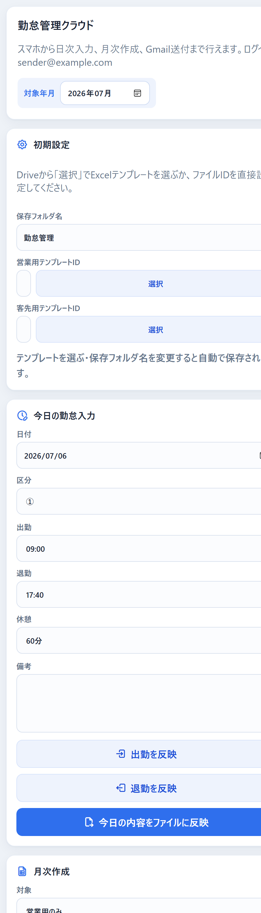

# 勤怠管理クラウド（Google Apps Script）

派遣就業状況報告書（営業用）と出勤簿（客先用）を、スマホからの勤怠入力だけで作成し、
Gmail 下書きまで用意できる **サーバーレスの勤怠・帳票自動化アプリ**です。
Google Apps Script（GAS）＋ Sheets / Drive / Gmail のみで動き、外部サーバーや課金は不要です。

> このリポジトリはポートフォリオ用の抜粋です。実際の個人情報（氏名・メール・宛先・派遣契約情報・
> テンプレートのファイルID等）はコードに含めず、GAS の **Script Properties** から読み込む設計です
> （`config.example.gs` がテンプレート、実値は Git 管理外の `config.local.gs` に記入して1回だけ投入）。

## スクリーンショット

> いずれもダミーデータの表示例です（実在の氏名・メール・IDは含みません）。

| PC | スマホ |
| --- | --- |
|  |  |

## できること

- スマホ対応の1画面 UI で、その日の勤怠（区分・出勤・退勤・休憩・備考）を入力
- 月次の Excel 帳票を自動生成（営業用＝就業状況報告書 / 客先用＝出勤簿）
- 生成済み Excel をたたき台に、当日分だけを反映（不要な再作成を防ぐ確認付き）
- 内容プレビュー（実ファイルがある月だけ表示）
- 月末確認 → Gmail 下書き作成（本番／自分宛てのテスト送信を切替。送信は最終確認ダイアログ後のみ）

## 技術的な工夫（ハイライト）

- **Excel を Sheets 変換せず直接編集**（営業用）：テンプレートの数式・書式・外部参照キャッシュを
  壊さないよう、`Utilities.unzip`/`zip` で入力セルだけを書き換え、必要な数式のキャッシュ値を当月へ更新。
- **Sheets のセル型自動変換対策**：日付/時刻を文字列で保存すると Sheet が Date 型に変換して
  読み戻す問題を、読み出し時の正規化とストアのタイムゾーン固定（Asia/Tokyo）で吸収。
- **データとコードの分離**：個人情報は Script Properties（`APP_CONFIG`）から読み込み、ソースには
  ダミーのみ。公開設定・OAuth スコープ・構文を `validate.mjs` で機械チェック。
- **安全側に倒した UX**：ファイルが無いのに「作成済み」に見えない／勝手に新規作成しない／
  月末確認とGmail下書きはファイルが揃うまで実行不可、など状態を厳密にゲート。

## 構成

```text
Code.gs            サーバーロジック（勤怠保存・帳票生成・Gmail・Drive・ストア管理）
Index.html         スマホ対応の1画面クライアント（HTML/CSS/JS）
appsscript.json    マニフェスト（TZ=Asia/Tokyo、Webアプリは実行=自分/アクセス=自分のみ）
config.example.gs  個人情報設定のテンプレート（実値は config.local.gs に。Git管理外）
validate.mjs       ローカル検証（公開設定・スコープ・構文チェック）
DEPLOY_CHECKLIST.md デプロイ前チェックリスト
```

データは Google Sheets（`勤怠管理データ`）に保存し、`attendance_days` などのシートを
SQLite のテーブル代わりに使います。生成 Excel は Drive の `勤怠管理/営業用|客先用/YYYYMM/` に出力します。

## セットアップ（概要）

```powershell
node validate.mjs   # 構文・公開設定・スコープの確認
```

1. GAS プロジェクトを新規作成し、`Code.gs` / `Index.html` / `appsscript.json` をコピー
2. `config.example.gs` を複製して `config.local.gs` を作り、実値を記入（★Git管理外★）
3. `installAppConfig` を1回実行して Script Properties へ設定を保存
4. ウェブアプリとしてデプロイ（実行ユーザー=自分／アクセス=自分のみ）
5. 画面の初期設定に、Google Sheets 化したテンプレートのファイルIDを入力

詳細は [`DEPLOY_CHECKLIST.md`](DEPLOY_CHECKLIST.md) を参照してください。

## セキュリティ

- Web アプリのアクセスは「自分のみ」。ソース公開で第三者が実データへアクセスすることはありません。
- 個人情報はソース・履歴に一切含めていません（実値は Script Properties 側）。
