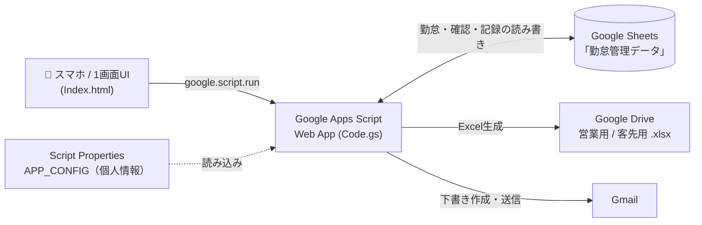

# 勤怠管理クラウド（Google Apps Script）

スマホからの勤怠入力だけで、**派遣就業状況報告書（営業用）と出勤簿（客先用）の Excel を自動生成し、
Gmail 下書きまで用意する**サーバーレス業務アプリです。
Google Apps Script（GAS）＋ Sheets / Drive / Gmail のみで動作し、外部サーバー・課金・追加インフラは不要です。


> **A serverless timesheet-to-Excel automation built entirely on Google Apps Script.**
> A mobile-friendly single-page UI lets one user log daily attendance, auto-generate two
> monthly Excel reports (preserving template formulas/formatting), and prepare Gmail drafts —
> with no backend server and no cloud cost.

> ⚠️ このリポジトリはポートフォリオ用の抜粋です。氏名・メール・宛先・派遣契約情報・テンプレートの
> ファイルIDなどの**個人情報はソースにも履歴にも含めていません**。実値は GAS の **Script Properties**
> から読み込む設計です（`config.example.gs` がテンプレート、実値は Git 管理外の `config.local.gs` に記入）。

## スクリーンショット

> いずれもダミーデータの表示例です（実在の氏名・メール・IDは含みません）。

| PC | スマホ |
| --- | --- |
|  |  |

## 背景・解決した課題

派遣就業者は毎月、**2種類の帳票**（営業担当へ提出する就業状況報告書と、客先提出用の出勤簿）を
作成する必要があり、次の負担がありました。

- 毎日の勤怠を紙・手入力で二重管理し、月末にまとめて Excel へ転記していた
- 社内 PC のローカルアプリを使う運用は、外部公開できずスマホから触れない
- Excel テンプレートには**数式・書式・外部参照**が含まれ、ツールで作り直すと壊れやすい

これを、**スマホから毎日1回入力するだけ**で、テンプレートを壊さずに月次帳票が仕上がり、
提出用の Gmail 下書きまで用意される形に自動化しました。サーバー運用費ゼロ（GAS 無料枠）で回ります。

## 主な機能

- 📱 **スマホ対応の1画面 UI** — その日の勤怠（区分・出勤・退勤・休憩・備考）を入力
- 📄 **月次 Excel の自動生成** — 営業用（就業状況報告書）／客先用（出勤簿）
- 🔁 **当日分だけの反映** — 生成済み Excel をたたき台に更新（未作成時は確認してから作成）
- 👀 **内容プレビュー** — 実ファイルがある月だけ表示／その場で非表示トグル
- ✅ **月末確認 → Gmail 下書き** — 本番／自分宛てテスト送信を切替、送信は最終確認ダイアログ後のみ
- 🔔 **トースト通知** — 操作結果を上部ポップアップで表示し自動で消える

## アーキテクチャ



- **データストア**は Google Sheets（`勤怠管理データ`）。`attendance_days` などのシートを
  SQLite のテーブル代わりに使い、勤怠・月末確認・生成記録・Gmail下書き・設定・監査ログを保持。
- **帳票出力**は Drive の `勤怠管理/営業用|客先用/YYYYMM/` に xlsx を作成。
- **個人情報**はコードに持たず、Script Properties から読み込み。

## 技術的な工夫（ハイライト）

- **Excel を Sheets 変換せずに直接編集（営業用）**
  テンプレートの数式・書式・**外部参照キャッシュ**を壊さないよう、`Utilities.unzip` / `zip` で
  xlsx を展開し、入力セル（就業期間・各日の区分/始業/終業/休憩/備考）だけを書き換え。必要な数式の
  キャッシュ値を当月へ更新して、Excel/プレビュー双方で正しく表示されるようにした。
- **Google Sheets のセル型自動変換対策**
  `'2026-07-01'` や `'09:00'` を文字列で保存すると Sheet が日付/時刻型に変換し、読み戻すと Date に
  なる。これが原因の「保存済み勤怠がマージされない」「時刻が NaN」「処理が固まる」を、
  **読み出し時の正規化**とストアの**タイムゾーン固定（Asia/Tokyo）**で解消。
- **データとコードの分離**
  個人情報は Script Properties（`APP_CONFIG`）から読み込み、ソースはダミーのみ。公開設定・OAuth
  スコープ・構文を `validate.mjs` で機械的にチェックしてから配布。
- **安全側に倒した状態管理（UX）**
  「実ファイルの有無」を常に確認し、無いのに“作成済み/プレビュー可”に見せない・勝手に新規作成しない・
  月末確認と Gmail 下書きはファイルが揃うまで実行不可、など操作を厳密にゲート。

## 構成

```text
Code.gs             サーバーロジック（勤怠保存・帳票生成・Gmail・Drive・ストア管理）
Index.html          スマホ対応の1画面クライアント（HTML / CSS / バニラJS）
appsscript.json     マニフェスト（TZ=Asia/Tokyo、Webアプリ=実行:自分/アクセス:自分のみ）
config.example.gs   個人情報設定のテンプレート（実値は config.local.gs に。Git管理外）
validate.mjs        ローカル検証（公開設定・OAuthスコープ・構文チェック）
DEPLOY_CHECKLIST.md  デプロイ前チェックリスト
docs/               スクリーンショット
```

## セットアップ

```powershell
node validate.mjs   # 構文・公開設定・スコープの確認（Node.js のみ、追加依存なし）
```

1. GAS プロジェクトを新規作成し、`Code.gs` / `Index.html` / `appsscript.json` をコピー
2. `config.example.gs` を複製して `config.local.gs` を作り、実値を記入（★Git管理外★）
3. `installAppConfig` を1回実行して Script Properties へ設定を保存
4. ウェブアプリとしてデプロイ（実行ユーザー=自分／アクセス=自分のみ）
5. 画面の初期設定に、Google Sheets 化したテンプレートのファイルIDを入力

詳細は [`DEPLOY_CHECKLIST.md`](DEPLOY_CHECKLIST.md) を参照してください。

## セキュリティ / 個人情報の扱い

- Web アプリのアクセスは「自分のみ」（`assertAccess_` でログインアカウントを照合）。ソース公開で
  第三者が実データへアクセスすることはありません。
- 個人情報はソース・Git 履歴に一切含めず、実値は Script Properties 側に保持。
- 送信は必ず最終確認ダイアログの後。自分宛てのテスト送信モードあり。

## 制限事項

- 1人分の運用を想定（GAS の実行時間・送信数・Drive 容量の無料枠内）。
- 帳票テンプレートの初回準備（Drive へアップロード＋Sheets 化）が必要。
- 祝日は年度ごとに定義を更新。

## ライセンス

[MIT License](LICENSE)
